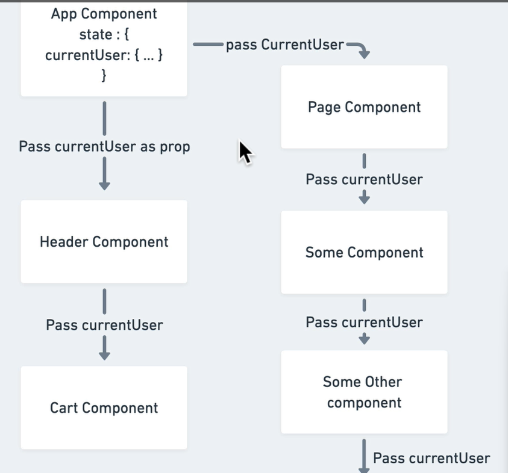
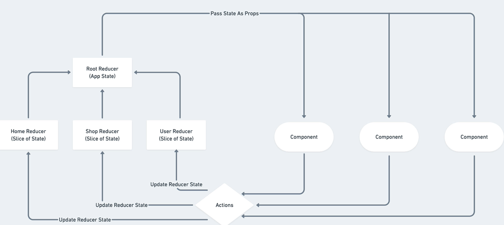

//first setup redux in project
//yarn add redux redux-logger react-redux
//we will now go to index.js file.
//Provider we will get from redux.

//index.j.....................................
import React from "react";
import ReactDOM from "react-dom/client";

import { BrowserRouter } from "react-router-dom";
import { Provider } from 'react-redux';

import "./index.css";
import App from "./App";

const root = ReactDOM.createRoot(document.getElementById("root"));
root.render(
  <React.StrictMode>
  <Provider>
    <BrowserRouter>
      <App />
    </BrowserRouter>
  </Provider>
  </React.StrictMode>
);

// ReactDOM.render(
//   <BrowserRouter>
//     <App />
//   </BrowserRouter>,
//   document.getElementById('root')
// );

//

//

//first reducer
//create a redux folder.
//create user folder and user.reducer file.
//create root-reducer.js file as well

//user.reducer.jsx..........................................
//this actually should be .js file since it won,t contain any jsx.
//reducer is just a function it get,s two property.

const INITIAL_STATE = {
    currentUser: null
}

//if reducer can,t find state then back to INITIAL_STATE
//first reducer.
const userReducer = (state = INITIAL_STATE, action) => {
    // we can use if else statement here as well

    switch (action.type) {
        case 'SET_CURRENT_USER':
        return{
           ...state,
           currentUser: action.payload 
        }

        default:
            return state;
    }
}

export default userReducer;

//